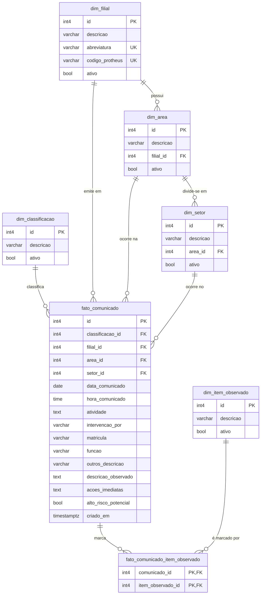

# Diagrama Entidade-Relacionamento — Comunicado de Intervenção



## Legenda

- `PK` — chave primária
- `FK` — chave estrangeira
- `UK` — chave única (`UNIQUE`)
- `||--o{` — relação **1 : N** (um para muitos)

## Hierarquia geográfica/organizacional

```
dim_filial  ───┐
               ├─►  dim_area  ───►  dim_setor
               │
               └─►  fato_comunicado
```

## Cardinalidades em linguagem natural

| Origem                | Destino                           | Cardinalidade | Semântica                                    |
|-----------------------|-----------------------------------|:-------------:|-----------------------------------------------|
| `dim_filial`          | `dim_area`                        | 1 : N         | Uma filial tem várias áreas                  |
| `dim_area`            | `dim_setor`                       | 1 : N         | Uma área tem vários setores                  |
| `dim_classificacao`   | `fato_comunicado`                 | 1 : N         | Uma classificação rotula N comunicados       |
| `dim_filial`          | `fato_comunicado`                 | 1 : N         | Uma filial concentra N comunicados           |
| `dim_area`            | `fato_comunicado`                 | 1 : N         | Uma área concentra N comunicados             |
| `dim_setor`           | `fato_comunicado`                 | 1 : N         | Um setor concentra N comunicados             |
| `fato_comunicado`     | `fato_comunicado_item_observado`  | 1 : N         | Um comunicado marca N itens do checklist     |
| `dim_item_observado`  | `fato_comunicado_item_observado`  | 1 : N         | Um item do checklist aparece em N comunicados|

A tabela `fato_comunicado_item_observado` **resolve a relação N : N** entre
`fato_comunicado` e `dim_item_observado` — um comunicado pode marcar vários
itens do checklist, e o mesmo item pode ter sido marcado por vários
comunicados distintos.

## Regras de integridade relevantes

- `fato_comunicado_item_observado.comunicado_id` tem `ON DELETE CASCADE`:
  ao excluir um comunicado, suas marcações somem junto.
- `uq_dim_area_filial_descricao` impede duas áreas com o mesmo nome na
  mesma filial (mas permite o mesmo nome em filiais distintas).
- `uq_dim_setor_area_descricao` impede dois setores com o mesmo nome na
  mesma área.
- `uq_dim_filial_abreviatura` e `uq_dim_filial_codigo_protheus` impedem
  duplicidade de sigla ou de código ERP em `dim_filial`.
